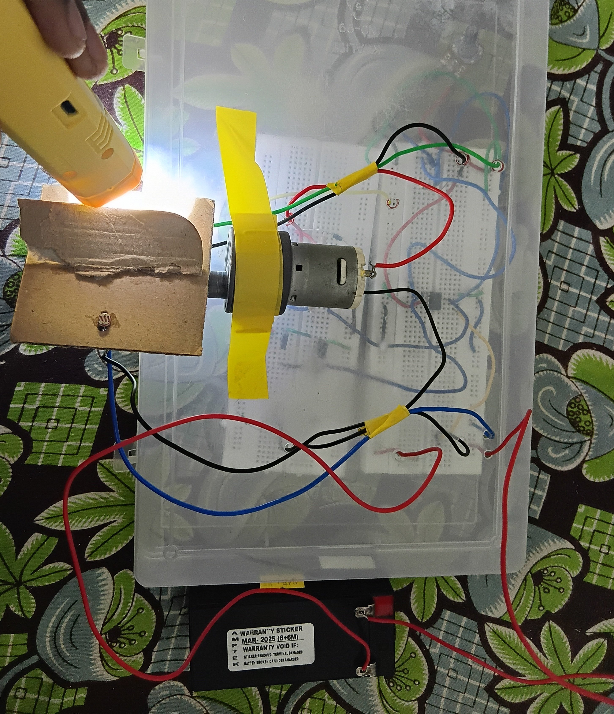
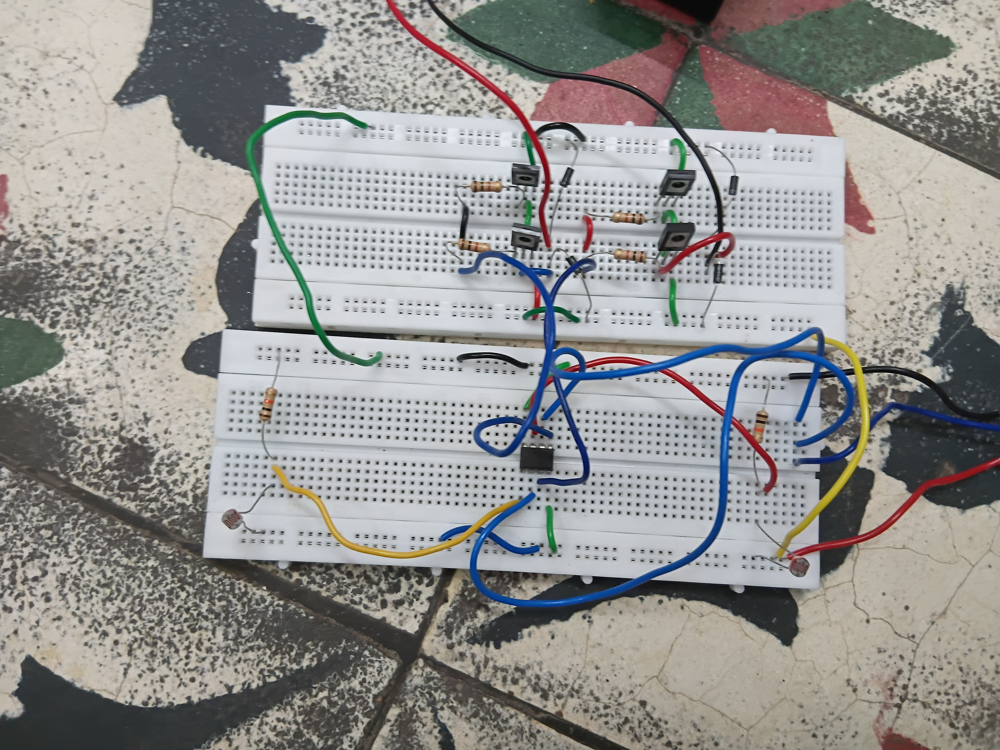

# Analog-Single-Axis-Solar-Tracker
Hardware-based Single Axis Solar Tracker using LDR, Transistors and Potentiometer.
# ☀️ Analog Single-Axis Solar Tracker

## Overview
The Analog Single-Axis Solar Tracker is a hardware-based renewable energy project that automatically tracks the direction of maximum sunlight using analog electronic components. The system rotates the solar panel along a single axis to improve solar energy collection without using any microcontroller.

## Objective
- To improve the efficiency of solar energy harvesting.
- To design a low-cost analog solar tracking system.
- To demonstrate automatic solar panel tracking using LDRs and transistor circuits.

## Components Used
- LDR (Light Dependent Resistor)
- Transistors
- Potentiometer
- DC Motor
- Solar Panel
- Resistors
- Power Supply
- Mechanical Mounting Frame

## Working Principle
The project uses two LDR sensors to detect the intensity of sunlight. When one LDR receives more light than the other, the transistor circuit activates the DC motor, rotating the solar panel toward the brighter side. The potentiometer is used to adjust the sensitivity of the tracking system. This enables the panel to follow the sun throughout the day along
## Project Images

### Front View

### Circuit Setup

### Working Model

## Project Report
The detailed project report is available in **Report.pdf**.
## Results

The developed analog single-axis solar tracker successfully tracked the direction of maximum sunlight using LDR sensors, transistors, and a potentiometer. The system automatically rotated the solar panel without requiring a microcontroller, demonstrating a simple and cost-effective solar tracking solution.

## Author

**Naveen Prakash R**

B.E. Electronics and Communication Engineering

GitHub: https://github.com/rnaveenprakash3bec28-arch
